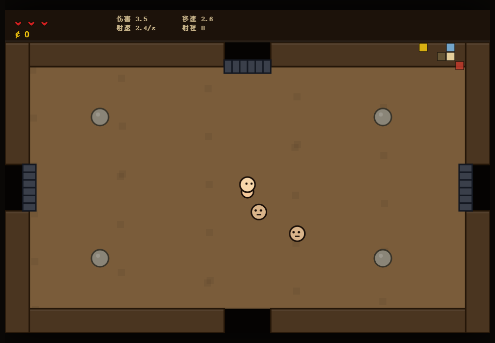

# 以撒的结合 · 网页复刻版 (The Binding of Isaac Clone)

用纯 HTML5 Canvas + 原生 JavaScript 复刻的经典肉鸽地牢游戏。所有角色、敌人、道具、房间图形均由代码实时绘制，还原以撒标志性的「圆润身体 + 粗黑描边 + 暗黑地下室」美术风格。



## 🎮 操作

| 按键 | 功能 |
|------|------|
| `W A S D` | 移动 |
| `↑ ↓ ← →` | 朝四个方向发射眼泪（支持斜向） |

**直接用浏览器打开 `index.html` 即可游玩**（无需服务器、无需构建）。

## 🕹️ 玩法流程

1. 在随机生成的地牢中探索，每层有若干普通房 + **Boss 房 / 宝藏房 / 商店房**。
2. 房间内有敌人时**房门关闭**，消灭所有敌人后开门。
3. 清房有概率掉落红心（回血）/ 金币 / 魂心（护盾）。
4. 宝藏房、商店房、Boss 掉落可拾取**道具**，实时强化属性。
5. 击败本层 Boss 后出现**活板门**，跳入进入下一层（共 3 层）。
6. 击败第 3 层最终 Boss 即**通关**；血量耗尽则**死亡**。

## ✨ 已实现的核心系统

- **随机地图生成器**：种子驱动的网格拓扑扩张算法，自动指定最偏远死胡同为 Boss 房，其余死胡同为宝藏/商店房；小地图实时显示已探索房间。
- **战斗系统**：双摇杆操作、眼泪弹道物理（射程/弹速/散射/穿透/追踪）、敌人 AI（追踪·苍蝇·冲锋·蜘蛛猛扑·远程弹幕·毒痰散射）。
- **3 个楼层 Boss**：蒙斯特罗（跳跃砸地+环形弹幕）、苍蝇公爵（召唤苍蝇+弹幕）、拉里（高速冲撞+散射），带血条。
- **道具系统**：16 种道具（悲伤洋葱/史蒂文/内眼/20·20/独眼巨人/硫磺火/圣心/丘比特之箭…），拾取实时改变**攻速/伤害/移速/射程/弹速/弹型（多发·穿透·追踪）**，并支持协同（内眼+20·20=更多发、穿透+追踪叠加）。
- **关卡流程**：开局 → 清房开门 → 掉落 → Boss 战 → 下层 → 通关/死亡判定，含无敌帧、受击溅血、屏幕震动、粒子特效。

## 🗂️ 代码结构

```
isaac/
├── index.html        # 入口 + 开始/死亡/通关界面
├── style.css         # 界面样式
├── js/
│   ├── utils.js      # 常量、种子随机数、数学/碰撞工具
│   ├── input.js      # 键盘输入（WASD + 方向键）
│   ├── items.js      # 16 种道具定义与属性修改
│   ├── dungeon.js    # 随机关卡/房间拓扑生成
│   ├── entities.js   # 玩家/眼泪/敌人AI/Boss/拾取物/粒子
│   ├── game.js       # 游戏状态、碰撞、清房、流程控制
│   ├── ui.js         # 房间/门/障碍渲染 + HUD + 小地图
│   └── main.js       # 启动与主循环（120Hz 逻辑步长）
└── test/
    └── playtest.js   # Playwright 自动试玩回归脚本
```

## 🤖 自动化试玩验证

每个模块完成后通过 Playwright 自动试玩、截图并断言：

```bash
cd test
npm install
npx playwright install chromium
node playtest.js
```

覆盖 30 项断言：标题渲染、初始状态、移动、**墙壁碰撞钳制**、眼泪生成、战斗门闭合、**真实射击消灭敌人→清房开门**、**道具拾取改变数值**、Boss 生成/血条/击杀掉活板门、**下层**、受击扣血/死亡判定、通关判定。截图输出到 `shots/`。

## ⚖️ 说明

本作为学习用途的粉丝复刻，玩法灵感来自 Edmund McMillen 的《The Binding of Isaac》，所有图形均为代码原创绘制，未使用原作素材。
